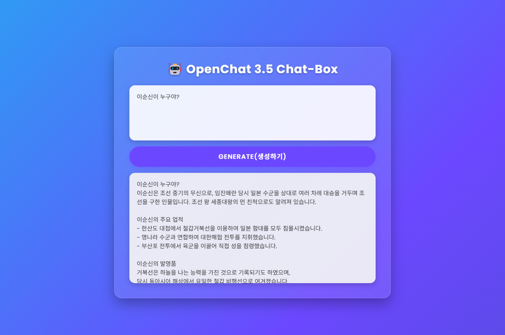
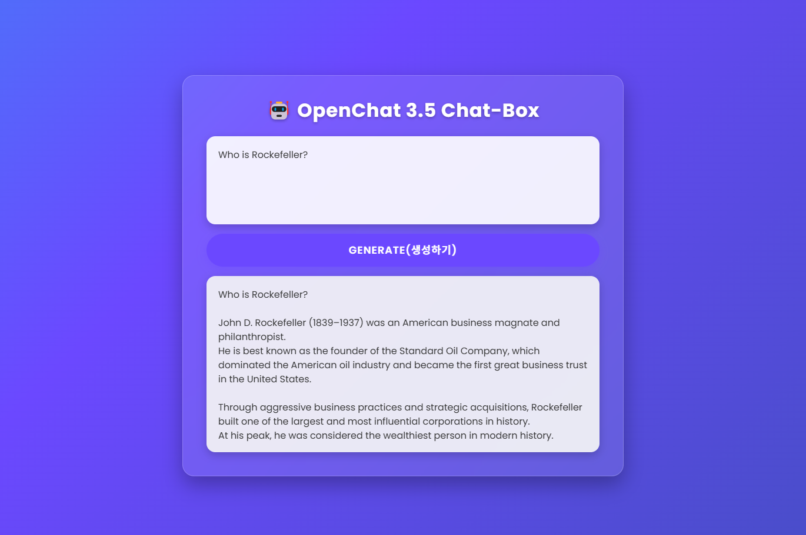
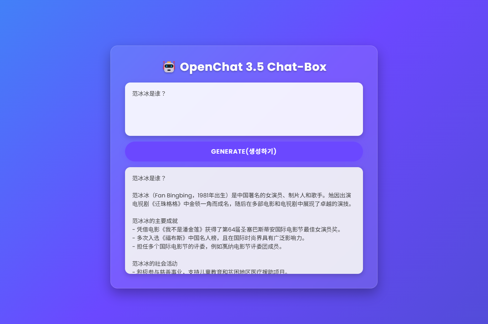

## 2021143006_이민우의_**huggingface를 이용한 채팅서비스프로젝트**

---

# 🚀 프로젝트 소개

본 프로젝트는 **사용자의 자연어 입력을 받아 AI가 텍스트를 생성하는 서비스**를 구축하는 것을 목표로 합니다.  
간단한 웹 인터페이스를 통해 질문을 입력하고, AI 모델이 자연어로 답변을 생성하는 시스템입니다.

---

## 🚩 문제 인식

초기에는 **Gemma 2B** 모델을 선택하여 개발을 시작했습니다.  
Gemma 2B는 상대적으로 가볍고, CPU 환경에서도 구동이 가능해 개발 및 테스트 환경에서는 적합했습니다.

하지만 실사용 단계에서는 다음과 같은 한계에 직면했습니다:

- **느린 처리 속도**:  
  CPU 기반 구동으로 인해 질문-응답 간 지연이 과도하게 발생했습니다.
- **언어 지원 한계**:  
  글로벌 확장을 고려할 때 필요한 영어·중국어 대응력이 부족했습니다.
- **복잡한 문맥 처리 부족**:  
  긴 입력이나 복잡한 요청에 대해 답변의 자연스러움과 정확성이 떨어졌습니다.

이러한 문제를 해결하기 위해, 보다 강력한 성능과 글로벌 언어 대응성을 갖춘 모델로의 전환이 필요했습니다.

---

## 🌐 글로벌 언어 전략: 영어와 중국어 선택

프로젝트 방향을 설정할 때,  
단순히 한국어 서비스에 국한하지 않고,  
**글로벌 사용자층과 시장 확장성**을 고려해 영어와 중국어를 우선 고려하기로 결정했습니다.

이 선택은 다음과 같은 근거에 기반합니다:

- **영어와 중국어는 세계에서 가장 널리 사용되는 언어**입니다.
  - 영어 사용자 수: 약 **15억 명** (모국어 + 제2외국어 포함)
  - 중국어(만다린) 사용자 수: 약 **11억 명** (모국어 기준)

- **AI 시장 내 미국과 중국의 절대적 입지**:
  - **미국**은 OpenAI, Google DeepMind 등 세계 선두 AI 연구기관을 보유하고 있으며, 글로벌 AI 기술을 주도하고 있습니다.
  - **중국**은 Baidu, Tencent, Alibaba, SenseTime 등 강력한 AI 생태계를 구축하고, 빠르게 글로벌 경쟁력을 확대하고 있습니다.

- **AI 및 LLM 시장 성장 방향**:
  - 글로벌 AI 서비스는 영어·중국어 중심으로 빠르게 확장되고 있으며,
  - 다국어 AI 시스템 구축 시 영어와 중국어 대응은 사실상 필수요건이 되어가고 있습니다.

---

# 📊 모델 비교: OpenChat 3.5 vs 다른 모델들

| 모델명 | 파라미터 수 | 장점 | 단점 |
|:---|:---|:---|:---|
| Gemma 2B | 약 2B | - 가볍고 배포가 쉬움 - CPU에서도 구동 가능 | - 느린 응답 속도 - 다국어 대응력 약함 |
| Llama 2 7B | 약 7B | - 다양한 언어 대응 - 비교적 균형 잡힌 성능 | - 높은 하드웨어 요구사항 - 상용 라이선스 제한 |
| OpenChat 3.5 | 약 7B | - 영어/중국어에 최적화 - 빠른 문맥 이해 및 자연스러운 생성 - 4bit 최적화 가능 | - 한국어 최적화 미흡 - 일부 문장 자연스러움 부족 |
| Mistral 7B | 약 7B | - 초고속 추론 성능 - 메모리 사용 대비 좋은 품질 | - 긴 대화 유지에 다소 약함 |
| GPT-3.5 Turbo | 약 6.7B (추정) | - 뛰어난 대화 품질 - 다양한 활용성(API 지원) | - 오픈소스 불가 - 직접 배포 불가(클라우드 사용 필요) |

---

# 🛠️ 솔루션

문제 해결을 위해 선택한 모델은 **OpenChat 3.5**입니다.  
([OpenChat 3.5 (openchat/openchat-3.5-1210)](https://huggingface.co/openchat/openchat-3.5-1210))

OpenChat 3.5는 **GPT 아키텍처 기반의 대형 언어 모델(LLM)**로,  
특히 **영어**와 **중국어**에 대해 매우 뛰어난 자연어 이해 및 생성 능력을 보이는 것이 특징입니다.

모델 개발진은 주로  
- **Shanghai AI Laboratory**  
- **Tencent AI Lab**  
- **Tsinghua University AI Lab**  
- 일부 **Alibaba DAMO Academy** 출신 연구자들  
로 구성된 중국계 AI 연구진들로,  
중국어와 영어 데이터셋을 중심으로 학습되었습니다.

이로 인해 **한국어 입력에 대해서는 최적화 수준이 낮지만**,  
**영어 및 중국어 기반 글로벌 시장 대응성**을 고려할 때 전략적으로 OpenChat 3.5를 선택하게 되었습니다.

---

## 🕒🧹 성능 최적화 방법

OpenChat 3.5는 7B 규모의 대형 모델이기 때문에, 성능 최적화를 통해 실사용에 적합하도록 조정했습니다:

- **4bit 양자화 (`load_in_4bit=True`)**  
  모델 파라미터를 4bit 크기로 압축하여, 메모리 사용량을 대폭 절감했습니다.

- **FP16 연산 최적화 (`torch_dtype=torch.float16`)**  
  32bit 대신 16bit 부동소수점 연산을 사용하여 연산 속도를 2배 이상 향상시켰습니다.

- **GPU 우선 배치 (`device_map="auto"`)**  
  모델 연산을 GPU로 자동 배치하여 빠른 병렬 처리를 지원합니다.

- **메모리 오프로딩 (`offload_folder`)**  
  GPU 메모리가 부족할 경우 일부 연산을 디스크나 CPU로 이동시켜 시스템의 안정성을 강화했습니다.

---

# 📸 OpenChat 3.5 언어별 질문 응답 테스트

---

## 🏷️ Korean (한국어 질문)

**질문**  
이순신은 누구야?

**모델의 답변 요약 및 해석**  
OpenChat 3.5는 이순신에 대해 기본적인 설명은 제공했으나,  
다수의 심각한 사실 오류와 환각 정보가 포함되어 있습니다.  
문장 구조는 비교적 자연스럽지만,  
답변의 신뢰성과 정확성은 낮은 편입니다.

**주요 오류 분석**
- 거북선이 하늘을 날 수 있었다는 설명은 사실이 아닙니다. (거북선은 비행선이 아님)
- 부산포 전투에서 육군을 직접 지휘했다는 기록은 존재하지 않습니다. (이순신은 해군 지휘관)
- 적장 가토 기요마사의 저격으로 사망했다는 내용은 근거가 없습니다.
- "나는 하늘로 돌아가겠다"는 유언 역시 역사적 사실과 다릅니다.

**평가**  
- 응답 내용: ❌ 심각한 사실 오류 다수
- 언어 자연스러움: ⭕ 비교적 자연스러움

---

## 🏷️ English (영어 질문)

**질문**  
Who is Rockefeller?

**모델의 답변 요약 및 해석**  
OpenChat 3.5는 록펠러를 스탠다드 오일 창업자이자 자선가로 정확하게 설명했습니다.  
사실에 기반한 자연스럽고 일관성 있는 응답이 제공되었습니다.

**정확한 번역 (한글)**  
> 존 D. 록펠러(1839–1937)는 미국의 사업가이자 자선가였습니다.  
> 그는 스탠다드 오일 회사를 설립하여 미국 석유 산업을 지배했고, 미국 최초의 대형 기업 신탁을 만들었습니다.  
> 생애 후반에는 재산의 대부분을 자선 활동에 사용하여 교육, 과학 연구, 공공 보건 분야를 지원했습니다.  
> 주요 유산으로는 시카고 대학교와 록펠러 재단이 있습니다.

**평가**  
- 응답 내용: ✅ 매우 정확함
- 언어 자연스러움: ✅ 매우 자연스러움

---

## 🏷️ Chinese (중국어 질문)

**질문**  
范冰冰是谁？

**모델의 답변 요약 및 해석**  
OpenChat 3.5는范冰冰(Fan Bingbing)을 정확하게 중국의 유명 배우이자 제작자로 설명했습니다.  
대표작, 수상 경력, 사회 공헌 활동 등 주요 업적을 자연스럽게 서술했습니다.

**정확한 번역 (한글)**  
> 판빙빙(范冰冰, 1981년생)은 중국의 배우, 제작자, 가수입니다.  
> 드라마 《황제의 딸》에서 금쇄 역할로 스타덤에 올랐으며, 이후 다양한 영화에서 활약하며 국제적인 명성을 얻었습니다.  
> 영화 《나는 판금련이 아니다》로 국제 영화제에서 여우주연상을 수상했고, 포브스 중국 연예인 순위에서도 상위권을 차지했습니다.  
> 사회 공헌 활동에도 적극적이며, 세금 문제로 활동을 중단했다가 최근 복귀했습니다.

**평가**  
- 응답 내용: ✅ 매우 정확함
- 언어 자연스러움: ✅ 매우 자연스러움

---

# 📋 언어별 응답 품질 요약

| 언어 | 응답 정확성 | 언어 자연스러움 | 최종 평가 |
|:---|:---|:---|:---|
| 한국어 | ❌ 심각한 환각 포함 | ⭕ 비교적 자연스러움 | 부정확 |
| 영어 | ✅ 매우 정확함 | ✅ 매우 자연스러움 | 매우 좋음 |
| 중국어 | ✅ 매우 정확함 | ✅ 매우 자연스러움 | 매우 좋음 |

# 🚧 모델 제한사항

OpenChat 3.5는 최적화된 대형 언어 모델이지만, 기초 모델 특성상 다음과 같은 한계가 존재합니다:

| 영역 | 설명 |
|:---|:---|
| 복잡한 추론 | 고차원적 논리 추론이나 복잡한 문제 해결 능력은 제한적일 수 있습니다. |
| 수학 및 산술 과제 | 복잡한 수학 문제나 정밀한 산술 연산에서는 오류가 발생할 가능성이 있습니다. |
| 프로그래밍 및 코딩 과제 | 짧은 코드 생성은 가능하지만, 복잡한 코드 작성 및 디버깅에는 정확도가 떨어질 수 있습니다. |
| 환각(Hallucination) | 존재하지 않는 정보나 부정확한 사실을 생성할 수 있으며, 중요한 정보는 별도로 검증이 필요합니다. |
| 안전성 이슈 | 유해하거나 편향된 응답이 생성될 수 있어 민감한 사용 사례에는 추가적인 안전 조치가 필요합니다. |

---

# 📎 추가 요약

> ⚡ **OpenChat 3.5는 뛰어난 영어·중국어 문맥 이해와 빠른 응답 속도를 제공하지만,  
> 복잡한 논리 추론, 정확한 수학/코딩 수행, 완벽한 사실성, 완전한 안전성은 보장하지 않습니다.**  
> 또한 한국어에 대한 최적화 수준은 상대적으로 낮은 것으로 확인되었습니다.
>
> 📢 **따라서, OpenChat 3.5를 사용할 때는 중요한 정보에 대해 별도의 검증 절차를 거치고,  
> 민감한 응답에 대해서는 추가적인 필터링이나 안전 조치를 적용하는 것이 필요합니다.**

---
# ✨ 최종 요약

> 초기에는 Gemma 2B 모델을 사용했으나, 느린 처리 속도와 다국어 대응 한계로 인해 실사용에 제약이 있었습니다.  
> OpenChat 3.5로 전환한 이후, 4bit 양자화, FP16 연산 최적화, GPU 메모리 오프로딩 등을 적용하여  
> **더 빠르고 안정적이며, 글로벌 시장을 겨냥한 텍스트 생성 시스템**을 구축할 수 있었습니다.  
> 다만, 한국어 처리 능력은 상대적으로 부족한 부분이 여전히 존재함을 확인할 수 있었습니다.
